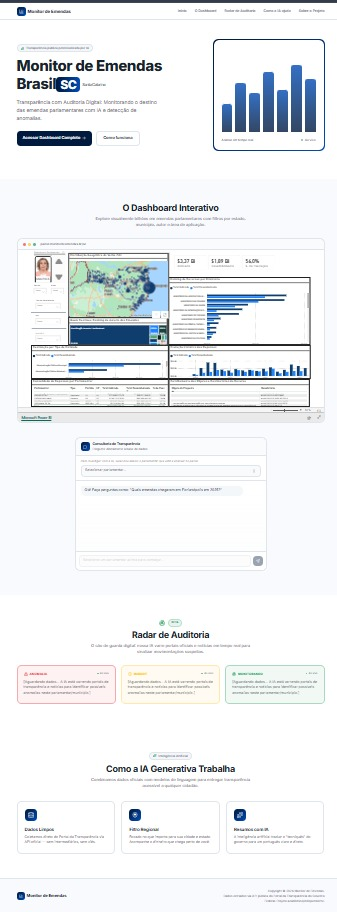
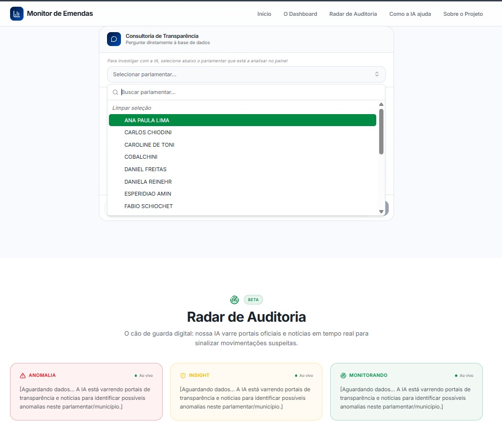
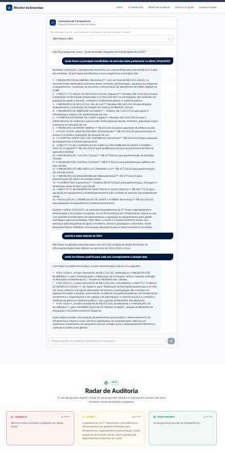

# 01 - Emenda Insight IA 📊 (Front-end & UI)

O **Emenda Insight IA** é uma plataforma inteligente voltada à transparência governamental e auditoria pública de emendas parlamentares federais. O ecossistema integra engenharia de dados robusta, um painel analítico interativo (Power BI) e um assistente de inteligência artificial generativa (Google Gemini) capaz de realizar cruzamentos financeiros e identificar padrões estratégicos em tempo real.

  

Este repositório contém o código-fonte da **Interface do Usuário (Front-end)**, desenvolvida sob os princípios de Vibe Coding e Design de Interfaces.

## 🛠️ Tecnologias Utilizadas no Front-end

* **Framework Principal:** React com Vite
* **Arquitetura:** TanStack Start com Server-Side Rendering (SSR)
* **Estilização:** Tailwind CSS
* **Geração de UI:** Lovable Dev Platform
* **Integração Analítica:** Microsoft Power BI (Embed)

## 🚀 Como a Interface Funciona

A aplicação foi desenhada para ser intuitiva, responsiva e focada na experiência do usuário (UX). O fluxo de uso é dividido em duas grandes áreas de interação:

### 1. O Dashboard Executivo
Um iframe embedado do Power BI detalhando a distribuição financeira das emendas através de mapas de calor, gráficos de barras e tabelas dinâmicas consolidadas.

### 2. A Consultoria de Transparência (Assistente IA)
O usuário seleciona um parlamentar (Câmara ou Senado) através de um menu suspenso de busca rápida:

  

A partir da seleção, o chat integrado aciona o nosso backend em nuvem. A IA lê exclusivamente os dados do parlamentar selecionado e preenche dinamicamente o chat e os 4 painéis de auditoria (Radar de Auditoria) com as seguintes chaves:
* *Resumo Analítico (Anomalia)*
* *Insights Estratégicos*
* *Status de Monitoramento*

  

## 🔗 Arquitetura de Backend (O Motor do Projeto)

Para garantir a segurança, performance e obediência aos limites de uma VPS de 1GB de RAM, o motor de orquestração (n8n), o processamento ETL em Python e as chamadas para a API do Google Gemini estão isolados em um microsserviço dedicado.

👉 **Você pode consultar a arquitetura de backend e infraestrutura aqui:** [Repositório 02 - Backend n8n](https://github.com/CarloGiacomoni/02-emenda-insight-ia-n8n)

---
*Desenvolvido com foco em transparência de dados, UI/UX e otimização de infraestrutura.*
